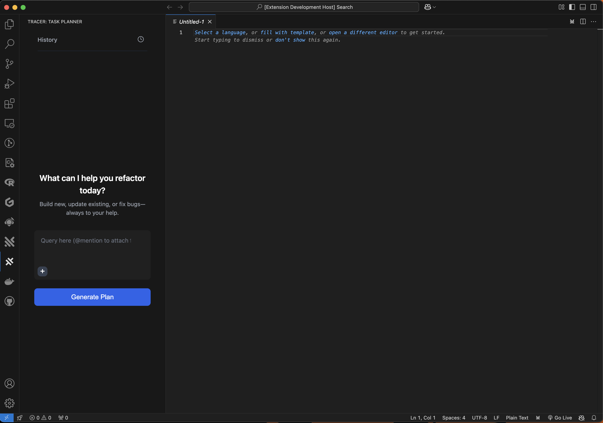

# AI-Powered Code Refactorer

## Project Overview
This project is an AI-powered Copilot for Code Planning and Generation, developed as part of the Traycer AI interview. It features general query support, personalized code modification plans and history of all your modifications.

## 🌟 Features
- Personal Plan/Code Copilot
- AI-powered code planning
- Smart and personalizable plans for better user experience
- Dark mode for comfortable viewing
- Responsive design

## 🛠️ Technologies Used

    

## Requirements
If you have any requirements or dependencies, add a section describing those and how to install and configure them.

## Extension Settings
Include if your extension adds any VS Code settings through the `contributes.configuration` extension point.

## Known Issues
Calling out known issues can help limit users opening duplicate issues against your extension.

## Release Notes
### 1.0.0
Initial release of tracer

### 1.0.1
Fixed issue #.
---

## Following extension guidelines
Ensure that you've read through the extensions guidelines and follow the best practices for creating your extension.
* [Extension Guidelines](https://code.visualstudio.com/api/references/extension-guidelines)

## For more information
* [Visual Studio Code's Markdown Support](http://code.visualstudio.com/docs/languages/markdown)
* [Markdown Syntax Reference](https://help.github.com/articles/markdown-basics/)

**Enjoy!**
