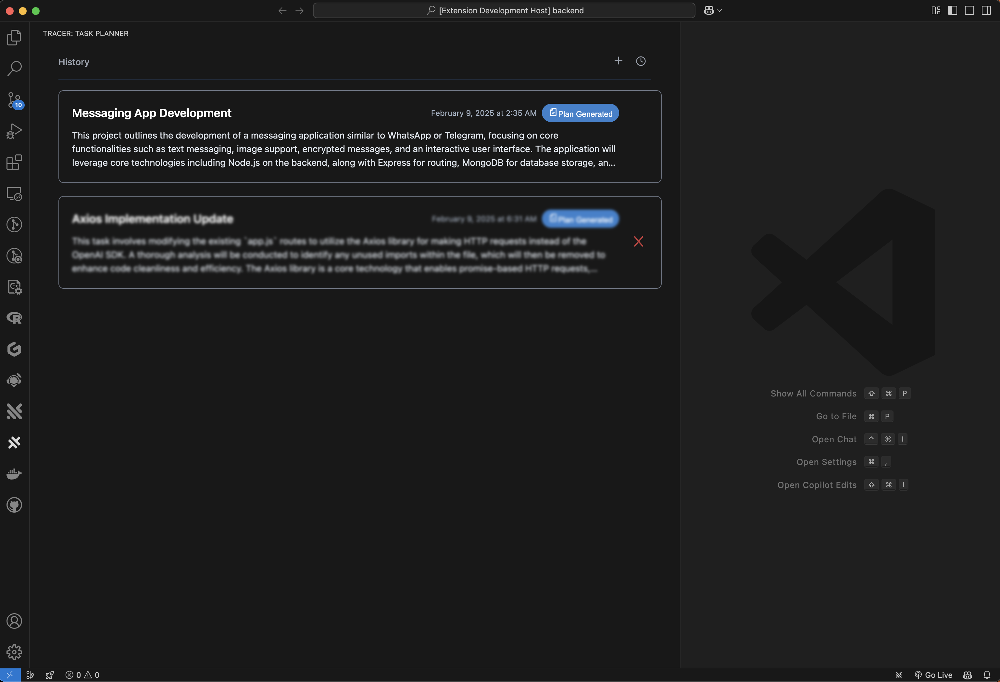
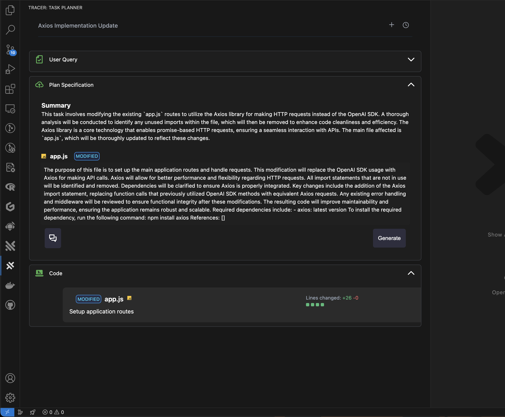
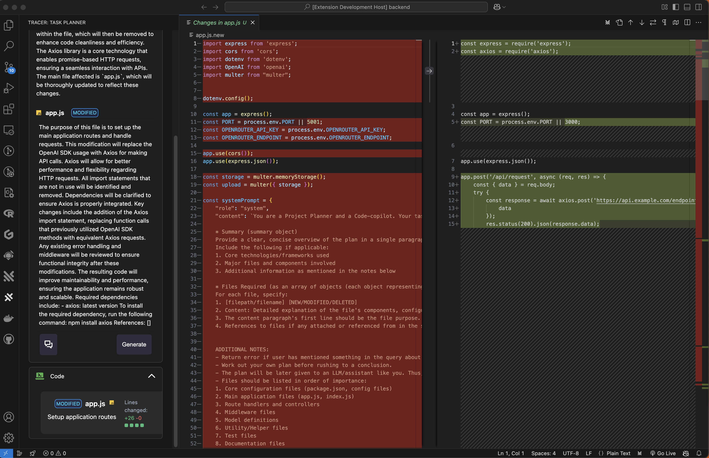

# AI-Powered Code Refactorer 1.0.2

## Project Overview
This project is an AI-powered Copilot for Code Planning and Generation, developed as part of the Traycer AI interview. It features general query support, personalized code modification plans and history of all your modifications.

## 🌟 Features
- Personal Plan/Code Copilot
- AI-powered code planning
- Smart and personalizable plans for better user experience
- Dark mode for comfortable viewing
- Responsive design

## 🛠️ Technologies Used

    

## Requirements
- Node.js
- npm
- vscode
- OpenRouter/OpenAI API key
- Good knowledge of programming
- Will try to include .vsix file in repo.

## .env file options
PORT=`xxxx`
OPENROUTER_ENDPOINT=`https://openrouter.ai/api/v1`
OPENROUTER_API_KEY=`xxxxxxxxxxxxxxxxxxxxxxxxxx`

## Extension Settings
- No custom configurations needed.
- Anyone welcome to make improvements to the codebase, just fork it.

## Known Issues
- Some issue may occur, due to no regression testing of a few test cases.

## How to run
- install node
- install npm
- clone this repository
- Remember to update your openRouter keys in .env file in _`tracer/backend/`_ folder
- Open terminal
    - Navigate to folder _`tracer/backend/`_
    - Run command `npm install`
    - Run command `npm run watch`
- Open terminal again
    - Navigate to folder tracer/tracer/
    - Run command `npm install`
    - Press F5
    - Select vscode development environment
- The extension is active, you can see it on the vscode sidebar.

## Release Notes
### 1.0.0
Initial release of tracer

### 1.0.1
Bug FIxes

### 1.0.2
Released the code generator along with code diff and much more

## Following extension guidelines
Ensure that you've read through the extensions guidelines and follow the best practices for creating your extension.
* [Extension Guidelines](https://code.visualstudio.com/api/references/extension-guidelines)

## For more information
* [Visual Studio Code's Markdown Support](http://code.visualstudio.com/docs/languages/markdown)
* [Markdown Syntax Reference](https://help.github.com/articles/markdown-basics/)

**Enjoy!**
